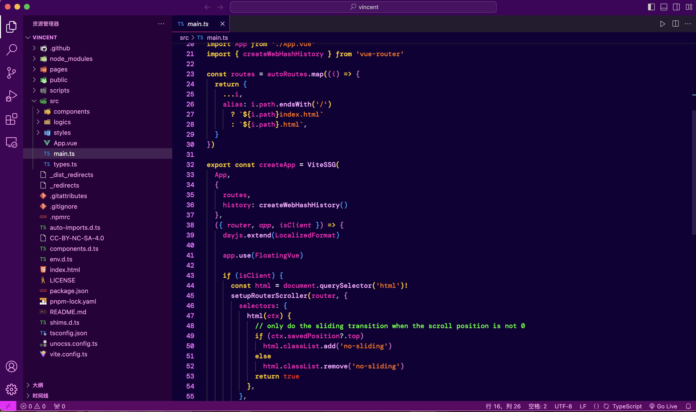

<h1 align="center">NeonHeart</h1>
<p align="center">An opinionated VS Code theme.</p>

<p align="center">
    <b><i>Let the neon lights colorize your heart. (๑•̀ㅂ•́)و✧</i></b>
</p>

# Installation

Search `neonheart` in VS Code extension menu.

# Enable Code Glowing (Yeeeeeah!!!!)

Use `Custom CSS and JS Loader` extension.


1. Install it.
2. Config your path of `glow.css` in `settions.json`.

    > [!WARNING]
    > `file://` is required!!!!

    the default extension path is：
    ```shell
        # macOS
        /Users/{USER_NAME}/.vscode/extensions
        # Windows
        C:/Users/{USER_NAME}/.vscode/extensions
        # Linux
        /home/{USER_NAME}/.vscode/extensions
    ```

    **Then, config your `settings.json`**
    
    macOS/Linux:
    
    ```json
    "vscode_custom_css.imports": [
        "file:///Users/{USER_NAME}/.vscode/extensions/glow.css"
    ],
    ```

    Windows: 
    ```json
    "vscode_custom_css.imports": [
        "file://C:/Users/{USER_NAME}/.vscode/extensions/glow.css"
    ],
    ```
3. Run Enable Custom CSS and JS

    - `Ctrl + Shift + P` or `Command + Shift + P`
    - Input `enable custom css and js`
        


# Preview

## Normal


## Glowing

